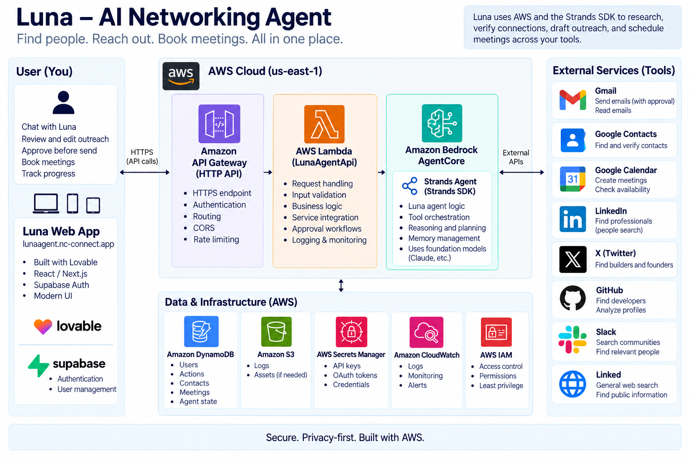

# Luna — Autonomous Networking Agent

**One request → Discover → Verify → Connect → Act**

Luna is an autonomous networking agent for founders and professionals. Give Luna a networking goal once, and it works across multiple applications to discover relevant people, verify credible connection paths, prepare outreach, and help turn the connection into a real meeting.

## Demo

**5-Minute Demo:** https://www.youtube.com/watch?v=k3xAZRK7skA&t=196s

**Live App:** https://lunaagent.nc-connect.app

---

## 1. Project Overview

Professional networking is fragmented across discovery, communication, contacts, and scheduling tools.

Finding someone may start on GitHub or X. Understanding whether you know them requires searching Contacts, Gmail, or Slack. Outreach happens somewhere else, and scheduling requires another application.

Luna turns this fragmented workflow into one agentic process.

Example request:

> Find me a technical cofounder in Toronto actively building AI agents. Find the strongest person I can realistically meet and help me get introduced.

Luna can:

1. Discover real candidates using GitHub and X.
2. Rank candidates using source-grounded evidence.
3. Search Google Contacts, Gmail, and Slack for credible connection paths.
4. Refuse to invent a warm introduction when one cannot be verified.
5. Fall back to direct outreach when no credible warm path exists.
6. Prepare personalized Gmail outreach.
7. Require explicit human approval before sending email.
8. Check real Google Calendar availability.
9. Require explicit approval before creating meetings.
10. Execute approved actions through the connected applications.

---

## 2.1 External Apps Used

Luna connects to six external applications:

| App | How Luna Uses It |
|---|---|
| GitHub | Finds technical candidates and verifies technical/project activity |
| X | Finds public professional and interest signals |
| Google Contacts | Searches existing contacts for relationship paths |
| Gmail | Verifies relationship history and sends approved outreach |
| Slack | Searches the connected workspace for people and connection signals |
| Google Calendar | Checks availability and creates approved meetings |

---

## 2.2. Supporting AWS Infrastructure

Luna uses several AWS services around the Strands agent:

| Service | Purpose |
|---|---|
| Amazon Bedrock | Foundation-model reasoning |
| Amazon Bedrock AgentCore | Production runtime for Luna |
| Strands Agents SDK | Agent orchestration and tool calling |
| Amazon API Gateway | Browser-facing API |
| AWS Lambda | Authentication, OAuth, async jobs, and AgentCore bridge |
| Amazon DynamoDB | Jobs, approval state, provider tokens, and application state |
| AWS Secrets Manager | API and OAuth credentials |
| AWS IAM | Access control between AWS resources |
| Amazon CloudWatch / AgentCore Observability | Logs, traces, debugging, and monitoring |

---

## 2.3. Frontend & Agent Backend

Luna's user-facing web application was built with **Lovable**, providing the interface for onboarding, authentication, connecting external services, and interacting with the agent.

The core autonomous agent runs separately on **AWS**. Luna was built with the **Strands Agents SDK**, powered by **Amazon Bedrock**, and deployed to **Amazon Bedrock AgentCore Runtime**. The frontend connects to this backend through **Amazon API Gateway and AWS Lambda**, allowing user requests from the web app to trigger Luna's live agent workflows.

In simple terms:

**Lovable Frontend → API Gateway → AWS Lambda → AgentCore Runtime → Strands Agent → Amazon Bedrock → External Tools**

The frontend is the interface; the autonomous reasoning, tool orchestration, approval handling, and execution happen in the AWS agent backend.

---

## 3. End-to-End Workflow

```text
NETWORKING GOAL
      ↓
DISCOVER
GitHub + X
      ↓
RANK CANDIDATES
Source-grounded evidence
      ↓
VERIFY CONNECTION PATH
Google Contacts + Gmail + Slack
      ↓
Credible warm path?
   ↙         ↘
 YES         NO
  ↓           ↓
Warm intro   Direct outreach
      ↘     ↙
     PREPARE
        ↓
 HUMAN APPROVAL
        ↓
   Gmail execution
        ↓
Calendar availability
        ↓
 HUMAN APPROVAL
        ↓
 Meeting created

This project was created with the [AgentCore CLI](https://github.com/aws/agentcore-cli).

```

---

## 4. Project Structure

The repository is organized into the Strands agent, AWS infrastructure, API layer, and external-service tools:

```text
luna-multi-app-agent/
├── AGENTS.md
├── agentcore/
│   ├── agentcore.json
│   └── cdk/
├── app/
│   └── LunaAgent/
│       ├── main.ts
│       ├── tools/
│       │   ├── github.ts
│       │   ├── x.ts
│       │   ├── google-contacts.ts
│       │   ├── gmail.ts
│       │   ├── gmail-send.ts
│       │   ├── calendar.ts
│       │   ├── calendar-create.ts
│       │   ├── slack.ts
│       │   └── pending-actions.ts
│       ├── model/
│       └── mcp_client/
├── luna-api-lambda/
│   └── index.mjs
└── README.md
```

---

## Architecture



---

## How Luna Was Built — From User Request to Real-World Action

Luna is not a single API call or a chatbot connected to a few services. It is a multi-step agent system built by combining **Strands Agents SDK, Amazon Bedrock, Amazon Bedrock AgentCore, AWS infrastructure, and six external applications**.

Here is the system in plain English.

### 1. The user gives Luna a goal

Everything starts with a natural-language request in the Luna web app.

For example:

> "Find me a technical cofounder in Toronto actively building AI agents. Find the strongest person I can realistically meet and help me get introduced."

The user does not need to tell Luna which applications to search or every individual step to perform.

---

### 2. The request reaches the AWS backend

```text
Luna Web App
      ↓
Authenticated API
      ↓
Amazon API Gateway
      ↓
AWS Lambda
      ↓
Amazon Bedrock AgentCore
```

The web application authenticates the user and sends the request through an API built with **Amazon API Gateway and AWS Lambda**.

Long-running agent requests are handled asynchronously. **Amazon DynamoDB** stores job state so the frontend can poll for the result without being limited by the API request timeout.

Lambda then invokes Luna running in **Amazon Bedrock AgentCore**.

---

### 3. Strands Agents SDK is Luna's orchestration layer

Inside AgentCore, Luna is built using the **Strands Agents SDK**.

Strands provides the agent loop that connects:

```text
User goal
   ↓
LLM reasoning
   ↓
Choose a tool
   ↓
Observe the result
   ↓
Reason about the new evidence
   ↓
Choose the next action
   ↓
Continue until the goal is completed
```

Instead of hard-coding one fixed sequence of API calls, Luna is given a set of tools and instructions. The agent determines which tools are appropriate based on the user's goal and the evidence returned during execution.

This is what turns Luna from a traditional workflow into an **agentic system**.

---

### 4. Amazon Bedrock provides the intelligence

The Strands agent uses a foundation model through **Amazon Bedrock** for reasoning.

Bedrock helps Luna understand the user's intent, interpret evidence returned by tools, compare candidates, decide which additional information is needed, and determine the appropriate next step.

The separation is roughly:

```text
Amazon Bedrock
      ↓
Reasoning

Strands Agents SDK
      ↓
Agent orchestration + tool use

Amazon Bedrock AgentCore
      ↓
Production agent runtime
```

---

### 5. Luna's capabilities are implemented as tools

Each external capability is exposed to the Strands agent as a tool.

```text
Strands Agent
     │
     ├── GitHub Search Tool
     ├── X Search Tool
     ├── Google Contacts Tool
     ├── Gmail Relationship Tool
     ├── Gmail Send Tool
     ├── Slack People Search Tool
     ├── Calendar Availability Tool
     └── Calendar Event Tool
```

The tools have different responsibilities.

| Tool / Service | Role in Luna |
|---|---|
| GitHub | Discover technical people and inspect public technical/project evidence |
| X | Discover public professional and interest signals |
| Google Contacts | Determine whether a candidate or potential connector already exists in the user's network |
| Gmail | Look for evidence of an existing relationship or previous communication |
| Slack | Search the user's connected workspace for additional connection signals |
| Gmail Send | Execute outreach after explicit human approval |
| Google Calendar | Check real availability and create approved meetings |

This allows the model to **reason**, while deterministic application code performs the actual external actions.

---

### 6. Luna discovers and ranks candidates

For a networking request, Luna can first use **GitHub and X** to discover people relevant to the user's goal.

```text
User goal
    ↓
GitHub + X
    ↓
Candidate evidence
    ↓
Compare and rank
    ↓
Strongest candidates
```

Candidate recommendations must be grounded in information returned by the tools. Luna is instructed not to invent people, qualifications, or evidence.

---

### 7. Luna tries to verify a real connection path

Finding a good person is only part of networking. Luna then tries to determine whether the user has a credible way to reach that person.

It can search:

```text
Google Contacts
       +
     Gmail
       +
     Slack
       ↓
Relationship evidence
```

These sources provide different signals.

For example, previous email history is stronger evidence of an existing relationship than simply belonging to the same Slack workspace.

Luna evaluates the evidence rather than automatically calling every signal a "warm connection."

---

### 8. Luna has a no-hallucination fallback

If Luna cannot verify a credible warm path, the workflow does not fail — and Luna does not invent one.

```text
Strong candidate
      ↓
Search connection evidence
      ↓
Credible warm path?
   ↙             ↘
 YES              NO
  ↓                ↓
Warm introduction  State that no credible
path               warm path was verified
                       ↓
                  Direct outreach
```

The candidate can still be recommended. Luna simply changes the strategy from a warm introduction to direct outreach.

---

### 9. Human approval separates reasoning from consequential actions

Luna can autonomously research, compare, verify, and prepare actions.

But sending an email or creating a calendar event crosses an execution boundary.

For those actions:

```text
Luna reasons
     ↓
Prepares action
     ↓
Creates pending approval
     ↓
STOPS
     ↓
Human reviews
     ↓
Explicit approval
     ↓
Action executes
```

Pending approvals are stored in **Amazon DynamoDB**, rather than existing only inside the model's conversation.

This creates a deterministic boundary between:

**AI reasoning** and **real-world execution**.

---

### 10. Approved outreach is executed through Gmail

Once the user explicitly approves an outreach action, Luna executes the approved Gmail operation.

```text
Prepared outreach
      ↓
Human approval
      ↓
Validate approval
      ↓
Gmail API
      ↓
Email sent
      ↓
Result returned to Luna
```

Luna therefore does not claim that an email was sent simply because the model decided to send one. The external action must actually execute.

---

### 11. Luna can continue from outreach to scheduling

The workflow can continue into Google Calendar.

Luna can check real availability first:

```text
Google Calendar
      ↓
Free/busy information
      ↓
Available time
```

Creating an event requires another explicit approval:

```text
Proposed meeting
      ↓
Human approval
      ↓
Google Calendar API
      ↓
Meeting created
```

This lets one networking goal move from **discovery all the way to a real meeting**.

---

### 12. AWS services provide the production infrastructure

Several AWS services support the agent around the Strands reasoning loop.

| AWS Service | Purpose |
|---|---|
| Amazon Bedrock | Foundation-model reasoning |
| Amazon Bedrock AgentCore | Runs the deployed Luna agent |
| Strands Agents SDK | Agent orchestration and tool calling |
| AWS Lambda | Authenticated API bridge and asynchronous job execution |
| Amazon API Gateway | Public backend API |
| Amazon DynamoDB | Async jobs, approval state, and provider-token/application state |
| AWS Secrets Manager | Secure storage for API/OAuth credentials |
| AWS IAM | Controls access between AWS resources |
| Amazon CloudWatch / AgentCore Observability | Runtime logging, debugging, and observability |

User authentication and profile information are integrated with **Supabase**, while AWS runs the agent and its execution infrastructure.

---

### Putting Everything Together

A complete Luna workflow looks like this:

```text
USER
"Find me a technical cofounder..."
        ↓
LUNA WEB APP
        ↓
AUTHENTICATED API
        ↓
API GATEWAY + LAMBDA
        ↓
BEDROCK AGENTCORE
        ↓
STRANDS AGENT
        ↓
AMAZON BEDROCK
        ↓
UNDERSTAND NETWORKING GOAL
        ↓
DISCOVER
GitHub + X
        ↓
RANK
Source-grounded candidates
        ↓
VERIFY
Google Contacts + Gmail + Slack
        ↓
CONNECTION DECISION
Warm path OR direct outreach
        ↓
PREPARE OUTREACH
        ↓
HUMAN APPROVAL
        ↓
GMAIL EXECUTION
        ↓
CHECK CALENDAR
        ↓
HUMAN APPROVAL
        ↓
CREATE MEETING
        ↓
GOAL COMPLETED
```

The result is a system where **Bedrock provides reasoning, Strands orchestrates the agent and its tools, AgentCore runs the agent, AWS services provide the production infrastructure, and external applications allow Luna to perform real work.**

The goal is not simply to answer:

> "Who should I meet?"

It is to take the user's networking objective from **intent → evidence → connection → approved action → real meeting**.
---

## Getting Started

Luna consists of two main backend components:

1. **LunaAgent** — the Strands agent that runs on Amazon Bedrock AgentCore and contains Luna's reasoning, tools, and approval logic.
2. **LunaAgentApi** — the AWS Lambda/API Gateway bridge that authenticates web requests, invokes the agent, and manages asynchronous jobs.

The production version is already deployed and can be tested here:

**Live App:** https://lunaagent.nc-connect.app

### Prerequisites

To run or deploy Luna yourself, you will need:

- Node.js 20+
- npm
- AWS CLI configured with an AWS account
- Amazon Bedrock access
- Amazon Bedrock AgentCore CLI
- AWS credentials with permission to use the required AWS services
- OAuth/API credentials for any external integrations you want to enable

External integrations used by Luna:

- GitHub
- X
- Google Contacts
- Gmail
- Google Calendar
- Slack

> Credentials, OAuth tokens, and local environment files are intentionally excluded from this public repository.

---

### 1. Install the Luna Agent

The main Strands agent is located in:

```text
app/LunaAgent/
```

Install its dependencies:

```bash
cd app/LunaAgent
npm install
```

Build the TypeScript agent:

```bash
npm run build
```

The main agent entry point is:

```text
app/LunaAgent/main.ts
```

Individual integrations and actions are implemented under:

```text
app/LunaAgent/tools/
```

---

### 2. Configure Credentials

Luna does not hard-code production credentials in source code.

Production secrets are stored using **AWS Secrets Manager**, while provider OAuth tokens and application state are stored server-side.

The agent expects credentials for the integrations being used, including:

```text
Google OAuth
GitHub OAuth/API
X API
Slack OAuth
```

Google integrations request the permissions required for:

```text
Contacts → read contacts
Gmail → read relationship history + approved email sending
Calendar → check availability + approved event creation
```

Never commit `.env`, OAuth token files, API keys, or client secrets to the repository.

---

### 3. Run the Agent Locally

For development, Luna can be run using the AgentCore development environment:

```bash
cd ../..
agentcore dev
```

A local environment can be used to test Strands tool execution before deploying the agent to AWS.

The development flow is:

```text
Edit LunaAgent
      ↓
Build TypeScript
      ↓
Run locally
      ↓
Test tool execution
      ↓
Deploy to AgentCore
```

---

### 4. Deploy Luna to Amazon Bedrock AgentCore

Luna's production agent runs on **Amazon Bedrock AgentCore**.

From the project root:

```bash
agentcore deploy
```

The AgentCore deployment packages the agent and deploys the runtime resources required to execute Luna on AWS.

The deployed flow becomes:

```text
User request
      ↓
Luna Web App
      ↓
API Gateway
      ↓
AWS Lambda
      ↓
Amazon Bedrock AgentCore
      ↓
Strands Agent
      ↓
Amazon Bedrock
      ↓
Luna Tools
```

---

### 5. Install the API Bridge

The browser-facing backend is located in:

```text
luna-api-lambda/
```

Install its dependencies:

```bash
cd luna-api-lambda
npm install
```

This Lambda acts as the secure bridge between the Luna web application and AgentCore.

It handles:

- authenticated requests
- OAuth connection/callback flows
- AgentCore invocation
- asynchronous agent jobs
- job-status polling
- user-specific provider connections

---

### 6. Supporting AWS Infrastructure

Luna uses several AWS services around the Strands agent:

| Service | Purpose |
|---|---|
| Amazon Bedrock | Foundation-model reasoning |
| Amazon Bedrock AgentCore | Production runtime for Luna |
| Strands Agents SDK | Agent orchestration and tool calling |
| Amazon API Gateway | Browser-facing API |
| AWS Lambda | Authentication, OAuth, async jobs, and AgentCore bridge |
| Amazon DynamoDB | Jobs, approval state, provider tokens, and application state |
| AWS Secrets Manager | API and OAuth credentials |
| AWS IAM | Access control between AWS resources |
| Amazon CloudWatch / AgentCore Observability | Logs, traces, debugging, and monitoring |

---

### 7. Test Luna

A simple discovery test:

```text
Find me a technical cofounder in Toronto actively building AI agents.
Find the strongest person I can realistically meet and help me get introduced.
```

A Calendar tool test:

```text
Check my Google Calendar availability tomorrow from 10 AM to 12 PM.
Do not create any event.
```

A key safety test is to ask Luna to perform a consequential action such as sending outreach.

Luna should **prepare the action but stop before execution and request explicit human approval**.

Only after a valid approval should the external action execute.

---

### 8. Verify the Deployment

The production system can be verified through the live application:

**Live Luna:** https://lunaagent.nc-connect.app

The demo shows the complete multi-application workflow, including discovery, relationship verification, approval boundaries, and real-world execution.

---

## Documentation

- [AgentCore CLI](https://github.com/aws/agentcore-cli)
- [AgentCore CDK Constructs](https://github.com/aws/agentcore-l3-cdk-constructs)
- [Amazon Bedrock AgentCore](https://aws.amazon.com/bedrock/agentcore/)

---

## Demo

🎥 **2-Minute Demo:** https://youtu.be/rhd7PJBfB7w
🎥 **5-Minute Demo:** https://www.youtube.com/watch?v=k3xAZRK7skA&t=196s

🌐 **Live Luna:** https://lunaagent.nc-connect.app

---

## License

This project is licensed under the Apache License 2.0. See the [LICENSE](LICENSE) file for details.
